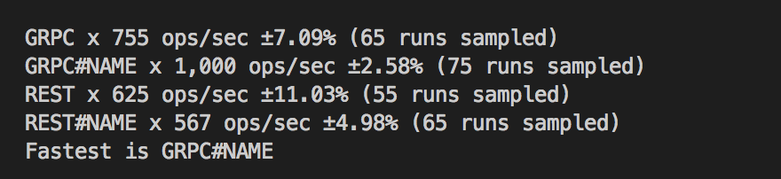

# grpc-vs-rest-benchmark
A NodeJS benchmark comparing gRPC server against an Express server

## Running the benchmark

1. Run REST server - `npm run start:rest`
2. Run gRPC server - `npm run start:grpc-server`
3. Run the benchmark - `npm run bench`

## Sample result 

   > gRPC for the win 🎉🎉🎉🎉

   